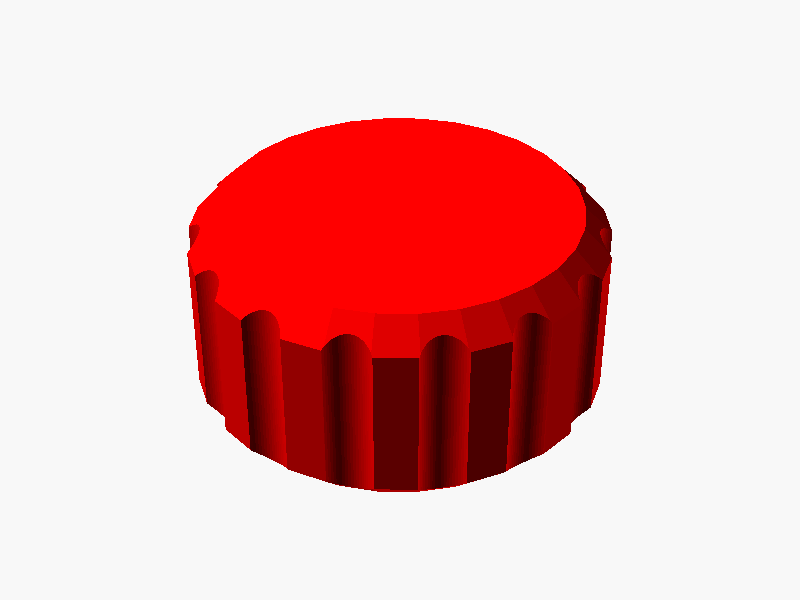
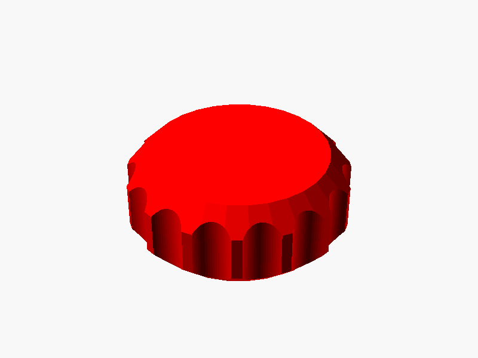
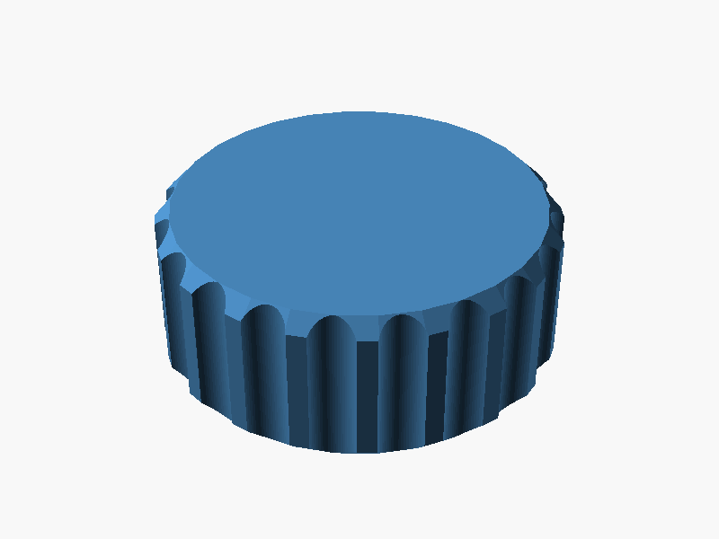
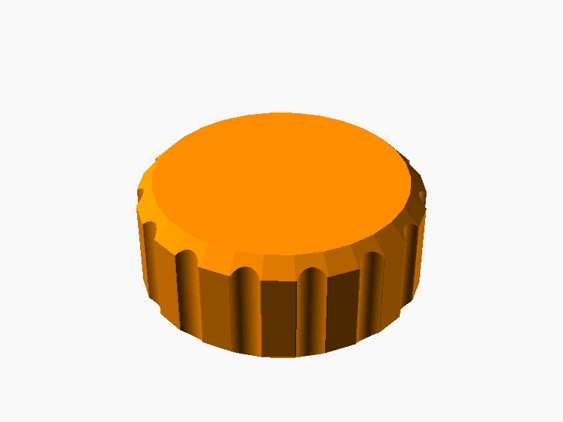
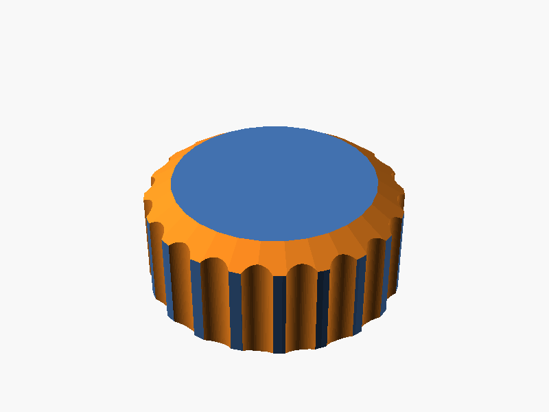
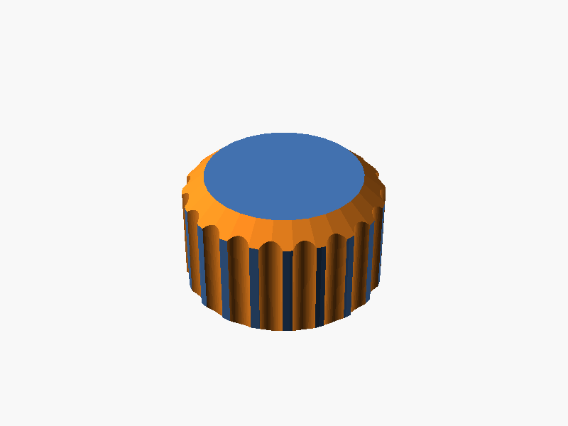

# parametric-knob-maker

Generate customisable 3D-printable knobs for toolless adjustment screws and thumbscrews.
Fork of [aminGhafoory/parametric-knob-maker](https://github.com/aminGhafoory/parametric-knob-maker).

This fork adds `parametric_knob.scad` -- a generalised round knob module with a configurable offset base, chamfers, and grip cutouts.

---

## Installation

Download or clone this repository into your OpenSCAD libraries folder:

```
~/.local/share/OpenSCAD/libraries/     (Linux)
~/Documents/OpenSCAD/libraries/        (macOS)
My Documents\OpenSCAD\libraries\       (Windows)
```

---

## `knob()` -- Round thumbscrew knob

**File:** `parametric_knob.scad`

Placed with Z=0 at the base. The knob has a narrower offset base, chamfered top and bottom edges, and equally-spaced cylindrical grip cutouts around the perimeter.

```openscad
include <parametric-knob-maker/parametric_knob.scad>

knob(
    knob_height,       // height of the main knob body         (default: 15)
    knob_diam,         // diameter of the main knob body       (default: 30)
    offset_height,     // height of the narrower base section  (default: 5)
    offset_diam,       // diameter of the base section         (default: knob_diam/2)
    knob_chamfer,      // top edge chamfer depth at 45 deg     (default: 2)
    base_chamfer,      // base edge chamfer depth at 45 deg    (default: 1)
    num_grip_cutouts,  // number of finger grip cutouts        (default: 15)
    grip_cutout_diam,  // diameter of each grip cutout         (default: 4)
    cutout_radius_adj, // outward offset of cutout centres     (default: 1)
    knob_color         // preview colour                       (default: "red")
);
```

### Examples

#### Default knob

```openscad
include <parametric-knob-maker/parametric_knob.scad>
knob();
```



---

#### Small thumbscrew knob

Compact knob suitable for M3/M4 screws where finger space is limited.

```openscad
include <parametric-knob-maker/parametric_knob.scad>
knob(knob_height=8, knob_diam=20, offset_height=2);
```



---

#### Large adjustment knob

Wide knob with more grip cutouts for applications needing high torque or fine control.

```openscad
include <parametric-knob-maker/parametric_knob.scad>
knob(
    knob_height      = 20,
    knob_diam        = 50,
    num_grip_cutouts = 20,
    grip_cutout_diam = 6,
    knob_color       = "SteelBlue"
);
```



---

#### Slim base

Narrow offset base for tight clearance around a mounting surface.

```openscad
include <parametric-knob-maker/parametric_knob.scad>
knob(
    knob_height   = 15,
    knob_diam     = 35,
    offset_height = 2,
    offset_diam   = 10,
    knob_color    = "DarkOrange"
);
```



---

#### Combining with a BOSL2 screw (e.g. for a thumbscrew)

```openscad
include <parametric-knob-maker/parametric_knob.scad>
include <BOSL2/std.scad>
include <BOSL2/screws.scad>

THREAD_LEN = 12;

union() {
    screw(spec="M5", length=THREAD_LEN+1, thread=true, anchor=BOTTOM);
    translate([0, 0, THREAD_LEN])
        knob(knob_height=10, offset_height=1);
}
```

---

## `hex_knob()` -- Knob with hex screw recess

**File:** `parametric_hex_knob.scad`

Knob with a hex socket recess in the base for capturing a hex-head bolt, and a through-hole for the bolt shaft.

> **Note:** The hex screw recess is currently under development and is commented out. The module renders the knob body and grip cutouts only.

```openscad
include <parametric-knob-maker/parametric_hex_knob.scad>

hex_knob(
    knob_height,          // height of the knob body           (default: 15)
    knob_diam,            // diameter of the knob              (default: 30)
    screwhead_facetoface, // hex head face-to-face size (mm)   (default: 8)
    screwhead_depth,      // depth of hex recess               (default: 12)
    thru_hole_diam,       // through-hole diameter             (default: 4)
    num_grip_cutouts,     // number of finger grip cutouts     (default: 20)
    grip_cutout_diam,     // diameter of each grip cutout      (default: 4)
    cutout_radius_adj     // outward offset of cutout centres  (default: 1)
);
```

### Examples

#### Default hex knob

```openscad
include <parametric-knob-maker/parametric_hex_knob.scad>
hex_knob();
```



---

#### Large hex knob

```openscad
include <parametric-knob-maker/parametric_hex_knob.scad>
hex_knob(
    knob_height      = 20,
    knob_diam        = 45,
    num_grip_cutouts = 24,
    grip_cutout_diam = 5
);
```



---

## DIN standard reference

The `screwhead_facetoface` parameter corresponds to the face-to-face dimension `s` in DIN 933.


---

## Known issues / TODO

- `hex_knob`: hex screw recess and through-hole are currently commented out (work in progress)
- `hex_knob`: base bump height scales with `knob_height` -- should be an independent parameter
- `hex_knob`: chamfers scale with knob height -- should be constant angles
